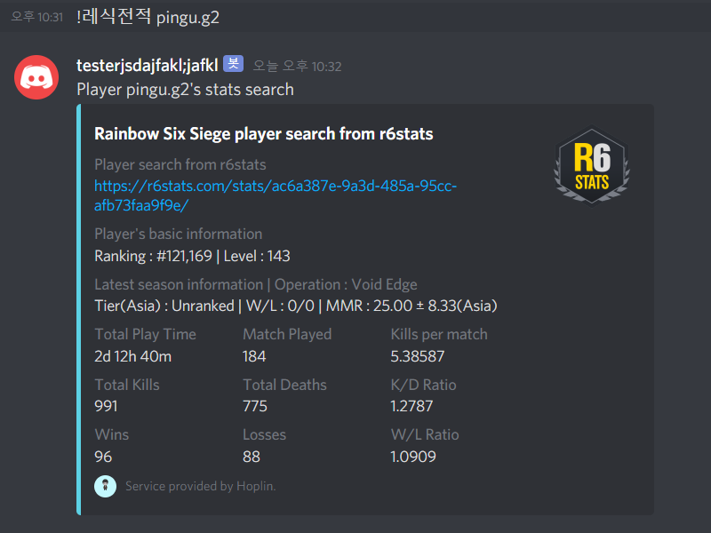

Discord Bot : Rainbow Six Siege player information search bot
===

**봇 소스코드를 가져가서 쓰시되, 출처를 꼭 밝히고 쓰시길 바랍니다**

***
1 . Discord.py Version : 1.0.0(Rewrite Version)

2 . Language : Python3

3 . What for? : To make able to see Rainbow Six Siege player to search their stats with command in discord

4 . Warning  : This Application is only available for PC version users. Think i'm not gonna support ps4,xbox version
***
  - Patch Note 20200329
    
    - Add Function : Convert to Normal English which has accents
   
  - Patch Note 20200402
  
    - Bug Fix
  
  - Patch Note 20200405
  
    - Add Latest Season MMR View
  
  - Patch Note 20200504

    - Until now you can only view best tier of rank in all three servers. This means, you can't view real-time tier.

    - In this patch note, now you can view your real time Asia server rank tier. 

    - MMR View and Tier view about America and Europe server will be patch later.
***

  - There are two function related to rainbow six siege stat search.
  
    1 . Normal Search : !레식전적 (nickname)
    
      - Search your R6 Rank informatier, Level, Tier
      
      

      
    
    2 . Search by operators : !레식오퍼 (nickname)
    
      - Search your stats about your use of operators
      
       
      
